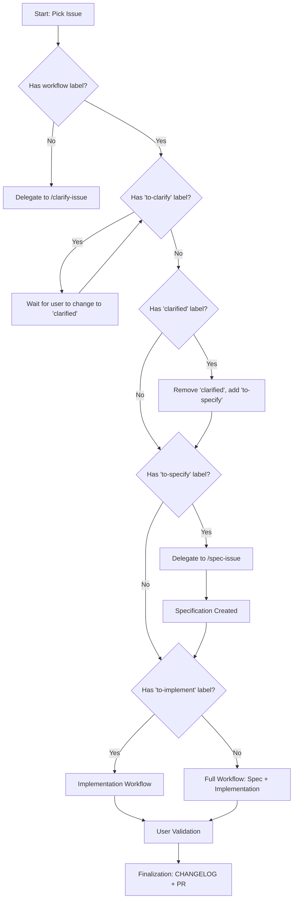

# Pick Issue Workflow (`/pick-issue`)

This skill automates the end-to-end lifecycle for picking an issue from the GitHub Project Board, specifying requirements, planning implementation, generating tasks, executing code changes, validating tests with the user, and logging the completed item in `CHANGELOG.md`.

---

## User Input & Parameters

```text
$ARGUMENTS
```

- **Parameter (Optional)**: Issue type or label filter (e.g., `feature`, `bug`, `enhancement`, `docs`).
- **Default Behavior**: If `$ARGUMENTS` is empty, automatically picks the **first item in the "Todo" column** of the project board.

---

## Target Project Board Context

- **Board URL**: `https://github.com/users/sebastienferry/projects/3`
- **Owner**: `sebastienferry`
- **Project Number**: `3`

---

## Workflow Steps

### Step 1: Query & Pick Next Issue from Project Board

1. **Check Prerequisites & Credentials**:
   Ensure `gh` CLI has project access permissions:
   ```bash
   gh auth status
   ```
   *If scope error occurs (`missing required scopes [read:project]`), prompt the user to run:*
   ```bash
   gh auth refresh -s project,read:project
   ```

2. **Fetch Project Items**:
   Query items from Project Board 3:
   ```bash
   gh project item-list 3 --owner sebastienferry --format json
   ```

   *Fallback (if project CLI is unauthenticated or empty)*:
   Query repository open issues filtered by label/type:
   ```bash
   gh issue list --owner sebastienferry --repo fretly --state open --json number,title,body,labels
   ```

3. **Select Target Issue**:
   - Filter items matching `status == "Todo"`.
   - If `$ARGUMENTS` is provided (e.g., `bug`), select the first Todo item with label/type matching `$ARGUMENTS`.
   - If `$ARGUMENTS` is empty, select the **first Todo item** that doesn't have workflow labels.
   - Extract: `ISSUE_NUM`, `ISSUE_TITLE`, `ISSUE_BODY`, `ISSUE_LABELS`, and `ITEM_ID`.

4. **Update Project Status**:
   Update status on Project Board 3 from `Todo` to `In Progress`:
   ```bash
   gh project item-edit --id "<ITEM_ID>" --project-id 3 --field-id "<STATUS_FIELD_ID>" --single-select-option-id "<IN_PROGRESS_OPTION_ID>"
   ```

---

### Step 2: Check for Clarification Needs

1. **Check for Issues Needing Clarification**:
   - If the issue doesn't have any workflow labels (`to-clarify`, `clarified`, `to-specify`, `to-implement`, `implemented`)
   - Run the clarification workflow:
   ```bash
   /clarify-issue
   ```
   *This will post clarifying questions and add the "to-clarify" label*

2. **Check for Clarified Issues**:
   - If the issue has "clarified" label, proceed to specification
   - Remove "clarified" label as part of the specification process

### Step 3: Speckit Design Workflow

Run the standard Speckit specification & planning pipeline:

1. **Specify Requirement**:
   ```bash
   /speckit-specify <ISSUE_TITLE>: <ISSUE_BODY>
   ```
   *Generates `specs/<NNN-feature-name>/spec.md`.*

2. **Clarify Requirements** *(if underspecified)*:
   ```bash
   /speckit-clarify
   ```

3. **Generate Implementation Plan**:
   ```bash
   /speckit-plan
   ```
   *Generates `plan.md`, `research.md`, `data-model.md`, `quickstart.md`.*

4. **Generate Task Breakdown**:
   ```bash
   /speckit-tasks
   ```
   *Generates dependency-ordered `tasks.md` checklist.*

---

### Step 3: Implementation & Coding Workflow

1. **Create Branch**:
   Create a clean feature or fix branch based on issue type:
   - For bug fixes: `git checkout -b fix/<ISSUE_NUM>-<short-name>`
   - For features: `git checkout -b feat/<ISSUE_NUM>-<short-name>`

2. **Execute Implementation**:
   ```bash
   /speckit-implement
   ```
   *Executes all tasks sequentially, creating/updating models, renderers, components, and tests.*

---

### Step 4: User Validation & Test Prompting

1. **Present Implementation Summary**:
   Provide a concise summary of all changes made during implementation.

2. **Prompt User for Validation & Test Additions**:
   Ask the user explicitly:
   > **Validation Prompt**: "Implementation for Issue #<ISSUE_NUM> (<ISSUE_TITLE>) is complete. Would you like to add any additional unit or integration tests, or validate the behavior before finalizing?"

3. **Run Automated Verification**:
   Execute repository checks:
   ```bash
   npm run build
   npm run lint
   npm test
   ```

---

### Step 5: Completion, Changelog & Board Sync

1. **Update `CHANGELOG.md`**:
   Open [CHANGELOG.md](file:///Users/sferry/Sources/fretly/CHANGELOG.md) and add an entry under the `## [Next]` section:
   - For features: Under `### Added` -> `- <ISSUE_TITLE> (#<ISSUE_NUM>)`
   - For bug fixes: Under `### Fixed` -> `- <ISSUE_TITLE> (#<ISSUE_NUM>)`

2. **Commit Changelog**:
   ```bash
   git add CHANGELOG.md
   git commit -m "docs(changelog): update CHANGELOG.md for issue #<ISSUE_NUM>"
   ```

3. **Create Pull Request**:
   ```bash
   /create-pr
   ```

4. **Mark Done on Project Board**:
   Update item status to `Done` on GitHub Project Board 3.

---

## Multi-Agent Execution

When running with subagents or multi-agent delegation:

### For Issues Needing Clarification:
- **Clarification Subagent** (`/clarify-issue`): Posts clarifying questions and adds "to-clarify" label
- **Lead Agent**: Waits for user to provide answers and change label to "clarified"

### For "clarified" Issues:
- **Specification Subagent** (`/spec-issue`): Detects "clarified" label, removes it, adds "to-specify", and executes specification creation
- **Implementation Subagent**: Executes Step 4-6 (planning, implementation, validation, finalization)
- **Lead Agent**: Coordinates the handoff between specification and implementation phases

### For "to-specify" Issues:
- **Specification Subagent** (`/spec-issue`): Executes specification creation and label transition
- **Implementation Subagent**: Executes Step 4-6 (planning, implementation, validation, finalization)
- **Lead Agent**: Coordinates the handoff between specification and implementation phases

### For "to-implement" Issues:
- **Implementation Subagent**: Executes Step 4-6 directly
- **Lead Agent**: Manages user validation and finalization

### For Unlabeled Issues:
- **Clarification Subagent**: Executes Step 2 (posts clarifying questions)
- **Design Subagent**: Executes Step 3 (Speckit planning and tasks)
- **Implementation Subagent**: Executes Step 4 (`speckit-implement`) in an isolated feature branch
- **Lead Agent**: Coordinates Step 5 user validation and Step 6 CHANGELOG / PR finalization

---

## Workflow Summary



## Alternative: Direct Agent Usage

For more granular control, users can invoke agents directly:

1. **Clarification Only**:
   ```
   /clarify-issue    # Asks questions, transitions to "to-clarify"
   ```

2. **Specification Only**:
   ```
   /spec-issue    # Creates spec, transitions "to-specify"/"clarified" → "to-implement"
   ```

3. **Implementation Only**:
   ```
   /code-issue    # Implements code, transitions "to-implement" → "implemented"
   ```

4. **Full Workflow** (legacy):
   ```
   /pick-issue    # Handles clarification, spec and implementation based on labels
   ```

## Agent Responsibilities

| Agent | Role | Input Label | Output Label | Primary Command |
|-------|------|-------------|---------------|-----------------|
| `/clarify-issue` | Clarification | None (Todo status) | `to-clarify` | Ask questions in comments |
| `/spec-issue` | Product Owner | `to-specify` or `clarified` | `to-implement` | `/speckit-specify` |
| `/code-issue` | Developer | `to-implement` | `implemented` | `/speckit-implement` |
| `/pick-issue` | Orchestrator | Any | Depends on input | Delegates as needed |

This modular approach allows:
- **Separation of concerns**: Clarification (`clarify-issue`) vs Product owner (`spec-issue`) vs Developer (`code-issue`)
- **Reusability**: Each agent can be used independently
- **Flexibility**: `pick-issue` remains backward compatible and can handle all issue types
- **Clear handoffs**: Issues transition from "to-clarify" → "clarified" → "to-specify" → "to-implement" → "implemented"
