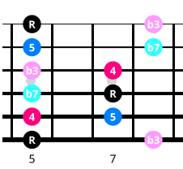
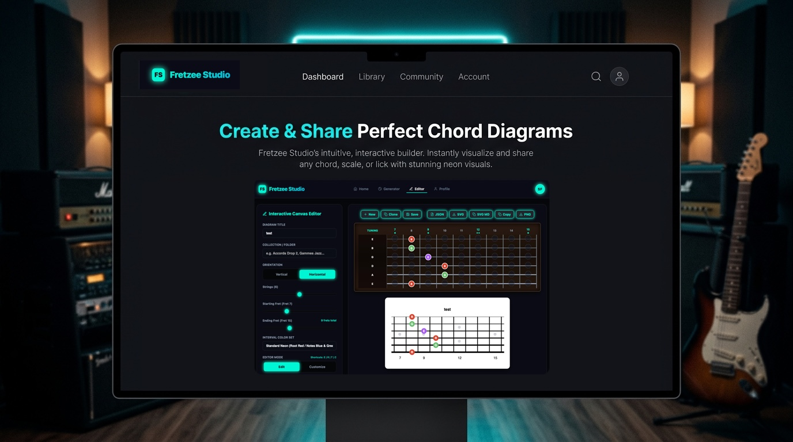

# Fretzee

<p align="center">
  
</p>

<p align="center">
  <a href="https://www.npmjs.com/package/fretzee"></a>
  <a href="https://www.npmjs.com/package/fretzee"></a>
  <a href="https://github.com/sebastienferry/fretzee/actions/workflows/ci.yml"></a>
  <a href="https://sebastienferry.github.io/fretzee/"></a>
  <a href="LICENSE"></a>
  <a href="https://ko-fi.com/sebastienferry"></a>
</p>

> Zero-dependency, lightweight TypeScript & JavaScript library for rendering customizable, vector SVG guitar and bass chord & scale diagrams.

<p align="center">
  <b><a href="https://sebastienferry.github.io/fretzee/demo.html">Live Showcase / Demos</a></b> &nbsp;•&nbsp; 
  <b><a href="https://sebastienferry.github.io/fretzee/editor.html">Live JS/JSON Editor</a></b> &nbsp;•&nbsp; 
  <b><a href="https://www.fretzee.com">Fretzee Studio SaaS</a></b>
</p>

---

## Table of Contents

- [Features](#features)
- [Installation](#installation)
- [Usage](#usage)
  - [Basic Fretboard](#basic-fretboard)
  - [Chord Diagram with Muted Strings & Roots](#chord-diagram-with-muted-strings--roots)
  - [Change Starting Fret](#change-starting-fret)
- [Configuration Reference](#configuration-reference)
  - [Fretboard Options](#fretboard-options)
  - [Fingering Object Options](#fingering-object-options)
- [PNG Export](#png-export)
- [Fretzee Studio Web App](#fretzee-studio-web-app)
- [Support the Project](#support-the-project)
- [License](#license)

---

## Features

- **Zero Runtime Dependencies** — Tiny footprint, fast execution.
- **Vector SVG Graphics** — High resolution, crisp on all displays, responsive scaling.
- **Horizontal & Vertical Layouts** — Suited for chord boxes, scale paths, and neck-wide diagrams.
- **Multi-Instrument** — Guitar (6-string), Bass (4-string), 5-string, 7-string, 8-string, and custom tunings.
- **Advanced Fingerings** — Root note highlights, interval badges, muted strings (<kbd>X</kbd>), open strings (<kbd>O</kbd>), custom text, and custom colors.
- **Native PNG Export** — Export directly to high-resolution PNG using HTML5 Canvas.

---

## Installation

### NPM / Yarn / PNPM

```bash
npm install fretzee
```

### Public CDNs (Browser Script)

Include directly in HTML without a build step:

```html
<!-- via unpkg -->
<script src="https://unpkg.com/fretzee@latest/dist/index.umd.js"></script>

<!-- via jsDelivr -->
<script src="https://cdn.jsdelivr.net/npm/fretzee@latest/dist/index.umd.js"></script>
```

```javascript
// Access exported global Fretzee class
const fretboard = new Fretzee.Fretboard({ stringCount: 6, fretCount: 12 });
document.body.appendChild(fretboard.render());
```

## Usage

### Basic Fretboard

```typescript
import { Fretboard } from 'fretzee';

// Standard 6-string guitar fretboard with 12 frets
const fretboard = new Fretboard({
  stringCount: 6,
  fretCount: 12,
  orientation: 'horizontal'
});

const svgElement = fretboard.render();
document.body.appendChild(svgElement);
```

### Chord Diagram with Muted Strings & Roots

```typescript
import { Fretboard } from 'fretzee';

// C Major Chord Diagram (Vertical)
const chord = new Fretboard({
  title: 'C Major',
  stringCount: 6,
  fretCount: 4,
  orientation: 'vertical',
  fingerings: [
    { string: 1, fret: 0, text: 'O' },                                         // Open High E
    { string: 2, fret: 1, text: '1' },                                         // 1st fret (C)
    { string: 3, fret: 0, text: 'O' },                                         // Open G
    { string: 4, fret: 2, text: '2' },                                         // 2nd fret (E)
    { string: 5, fret: 3, text: '3', color: '#00f5d4', textColor: '#090d16' }, // Root (C)
    { string: 6, fret: -1, text: 'X', color: '#ef4444' }                       // Muted Low E
  ]
});

document.body.appendChild(chord.render());
```

### Change starting fret

```typescript
import { Fretboard } from 'fretzee';

// A Minor Barre Chord at 5th Fret
const barreChord = new Fretboard({
  title: 'Am (Barre V)',
  stringCount: 6,
  fretCount: 4,
  startFret: 5,
  orientation: 'vertical',
  fingerings: [
    { string: 1, fret: 5, text: '1' },
    { string: 2, fret: 5, text: '1' },
    { string: 3, fret: 5, text: '1' },
    { string: 4, fret: 7, text: '3' },
    { string: 5, fret: 7, text: '2' },
    { string: 6, fret: 5, text: '1', color: '#00f5d4', textColor: '#090d16' } // Root
  ]
});

document.body.appendChild(barreChord.render());
```

## Configuration Reference

### Fretboard Options

| Option | Type | Default | Description |
| :--- | :--- | :--- | :--- |
| `title` | `string` | `undefined` | Optional title header displayed above the fretboard |
| `titleAlignment` | `'center' \| 'left'` | `'center'` | Title alignment relative to width |
| `stringCount` | `number` | `6` | Number of strings (4 for bass, 6 for guitar, up to 8) |
| `fretCount` | `number` | `12` | Number of frets displayed (4 to 24) |
| `startFret` | `number` | `1` | Starting fret position (1 to 24) |
| `orientation` | `'horizontal' \| 'vertical'` | `'horizontal'` | Layout orientation |
| `showInlays` | `boolean` | `true` | Show fret number inlays and position markers |
| `inlayPositions` | `number[]` | `[3, 5, 7, 9, 12, 15, 17, 19, 21, 24]` | Frets where dots are drawn |
| `tuning` | `string[]` | `undefined` | Tuning labels (e.g. `['E', 'A', 'D', 'G', 'B', 'E']`) |
| `fingerings` | `Fingering[]` | `[]` | Array of marker positions to render |

### Fingering Object Options

| Property | Type | Required | Description |
| :--- | :--- | :---: | :--- |
| `string` | `number` | Yes | 1-based string number (1 = highest pitch string) |
| `fret` | `number` | Yes | Fret index (`-1` = Muted 'X', `0` = Open 'O', `1..24` = Fretted position) |
| `text` | `string` | No | Character/interval displayed in marker (e.g. `'R'`, `'3'`, `'5'`, `'X'`, `'O'`) |
| `color` | `string` | No | Hex / CSS background fill color (e.g. `'#00f5d4'`) |
| `textColor` | `string` | No | Hex / CSS text font color (default `'#ffffff'`) |
## PNG Export

Export fretboard diagrams as PNG images without extra dependencies:

```typescript
// Export to Blob
const pngBlob = await fretboard.toPNGBlob({ scale: 2 });

// Export to Data URL (base64)
const dataUrl = await fretboard.toPNGDataURL({ scale: 2 });

// Direct browser file download
await fretboard.downloadPNG('chord-diagram.png', { scale: 2 });
```

## Interactive editor : Fretzee Studio

For an interactive web interface with cloud diagram storage and a visual editor, check out **[Fretzee Studio](https://www.fretzee.com)**.

[](https://www.fretzee.com)

While `@fretzee/core` is **free and open-source** for programmatic integration, **[Fretzee Studio](https://www.fretzee.com)** is the complete web application SaaS featuring:
- **Visual Drag & Drop Editor**: Interactive canvas with click-to-add notes, roots (<kbd>R</kbd>), muted strings (<kbd>X</kbd>), custom colors, dual-thumb fret range slider, and wood themes (maple/rosewood).
- **Chords & Scale Generator**: Instant catalog lookup across chords, scales, modes, arpeggios, inversions, and drop voicings.
- **Cloud Storage & Collections**: Save, organize, and manage your diagrams in personal cloud collections.
- **Multi-Format Export**: Export to SVG, high-resolution PNG, JSON, Markdown, and JS code snippets.

[Launch Fretzee Studio Web App](https://www.fretzee.com) *(Free Account required)*

---

## Support the Project

Fretzee is an independent open-source project. If you find it useful, you can support its development and maintenance on Ko-fi:

[](https://ko-fi.com/sebastienferry)

---

## License

[MIT License](LICENSE) © Sébastien Ferry
